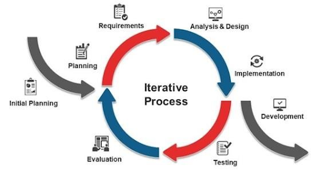
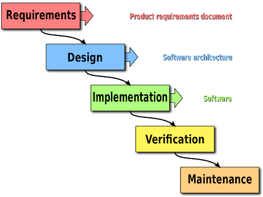
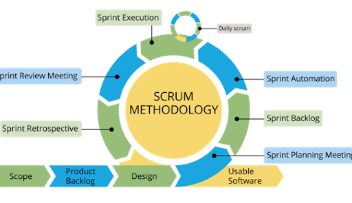
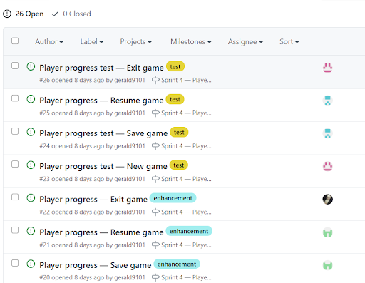
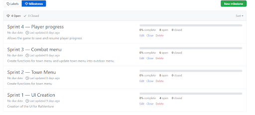
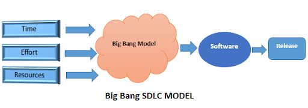

# RatVenture
# The Team
- QA - Adeline, Sean 
- Developers - Naomi, Gerald 

## USER STORIES
|      NO.      |    FEATURE    |  SUB FEATURE  |   USER STORY  |
| ------------- | ------------- | ------------- | ------------- |
|1|UI Creation|Main Menu|As a player I want to be able to select an option so that I can start the game.|
|    |    |    | As a player I want to be able to select an option so that I can resume a saved game.|
|    |    |    | As a player I want to be able to select an option so that I can exit the game.|
|    |    |Various Game Menus|As a player I want to have different game menus so that I can do different activities.|
|    |    |    |As a player I want to be able to have combat options so that I can fight my enemies.|
|    |    |World Map|As a player I want to be able to see a world map so that I know where my character is.| 
|2|Functions Creation in Town|View Character|As a player I want to be able to view my character’s damage so that I know how much damage I deal to enemies.|
|    |    |    |As a player I want to be able to view my character’s defence so that I know how well I defend against enemies.|
|    |    |    |As a player I want to be able to view my character’s health so that I know when I’m supposed to heal myself.|
|    |    |View Map|As a player I want to be able to view my character on the map so that I can plan out my next move.|
|    |    |Move |As a player I want movement instructions so that I know where I am moving my character.|
|    |    |    |As a player I want to see my selected movement key so I have confirmation on pressing the correct movement key.|
|    |    |Rest|As a player I want to be able to rest so that I can restore my health.|
|3|Functions Creation for Combat|Attack|As a player I want to be able to attack during a fight so that I can defeat the opponent.|
|    |    |    |As a player I want to be able to see how much damage I did to the enemy so that I know if I can defeat the enemy.|
|    |    |    |As a player I want to be able to see how much damage I’ve taken from the enemy so that I know how to plan my next move.|
|    |    |    |As a player I want to be able to have updates on my health so that I can plan my next move.|
|    |    |Run|As a player I want to be able to run away from a fight so that I can prevent myself from dying if I am low on health.|
|4|Saving Player Progress|New Game|As a player I want to be able to start a new game so that I can play the game.|
|    |    |Save Game|As a player I want to be able to save the game so that I can pause and come back to the game another time.|
|    |    |Save Game|As a player I want my game to override my previous save file so that I do not waste space on my computer.|
|    |    |Resume Game|As a player I want to load up a save of my previous game so that I can continue from where I stopped previously.|
|    |    |Exit Game|As a player I want to be able to exit the game so that I can stop playing and come back another time.|

## METHODLOGOIES CONSIDERED
1. Iterative Model
2. Waterfall Model
3. Scrum Model [Chosen]
4. Big Bang Model

## Why We Considered
### 1. Iterative 

  - Considerations:
    - When the requirements of the complete system are clearly defined and understood.
    - The major requirements are defined, while some functionalities and requested enhancements evolve with the process of the development process.
    - A new technology is being used and is being learnt by the development team, while they are working on the project.
  
In this assignment, all the requirements of the final product are clearly defined and understood. The timeline of the different development stages have been planned out in the Sprint Log. Each sprint we release a specific set of usable features, which are enhanced in the next sprint by other features. The features will be more advanced as each sprint passes, for example the first sprint will be simply creating the UI of the various game menus. The following sprints will be the actual development of the game functions such as Move, Rest and so on. As the Iterative Model allows accessing previous phases, we will be able to access the code from the previous sprints if any changes have to be made to the existing features. We will also be using a new technology, PyTest, to run the automated tests.
          
### 2. Waterfall

A linear project management approach, where stakeholders and requirements are gathered at the beginning of the project. A sequential approach is planned out to accommodate the requirements. This method is named so that each phrase of the project cascades into the next.

**Advantages:**
- It is a thorough, structured methodology suitable for smaller projects with deliverables that are easy to define. Going through these steps (Shown in figure above) 
- Waterfall relies on the team to follow a sequence of steps, only moving when the previous phase has been completed.
- Able to determine the end goal early 	
- Unlike scrum (Dividing projects into sprints), this method set the end goal as their main focus and has a concrete scheduling of the end date, this eliminates the risk of slowing down or pausing during the process. 
- Transfer information well
- Waterfall approach is highly methodical, it provides a clean transfer of information for each step. This methodology prioritizes accessible information so new additions to the team can get up to speed quickly if required. 
    
**Disadvantages:**
- Changes towards the projects are challenging 
- Waterfall follows a strict set of steps, in the traditional waterfall there is no room for unexpected changes or revisions. To be able to change the parameters of the project, it could render much of the work that will throw of the entire timeline
- Excludes the end user 
- This methodology focuses little on the end user involved in the project. 
- Delay testing until after completion of the project
- Teams have to follow the process of the methodology and wait until the step (testing) to be able to start their trial and error phrase. At this point the project might have taken a considerable time to complete, hence should there be an error that requires a large amount of revision, it can cause severe delays to the project.
    
For this assignment, all our requirements are well defined and will not change. We started off the assignment by carrying out requirement gathering and documentation. We have also planned out the development schedule with specific end goals in mind, hence reducing time wastage. We will also implement automated testing only after our features have been completed.
      
### 3. Scrum Model (***Chosen***)

Scrum is an agile project management methodology used primarily for software development projects. It is based on a set of very defined practices and roles that must be involved during the software development process. It is a flexible methodology that rewards the application of the 12 agile principles in a context agreed by all the team members of the product. 

The scrum methodology follows the values and the principles of agile, includes further definitions and specifications, especially regarding certain software development practices. 

The scrum model suggests that the project progresses via a series of sprints. In keeping with an agile methodology, sprints are timeboxed to no more than a month long, most commonly two weeks. One reason why it became our consideration, is due to the fact that this method can be applied on the github web application by setting the milestones as sprints. Additionally, allows the team to keep track of processes via creation of tasks on github and assigning them to the team members of the projects. 

**Advantages**
- Easily Scalable
  - Scrum mechanism is applicable for a single Scrum team and it can additionally be used for larger projects with multiple teams. This has the benefit of achieving better deliverable in line with the needs of the users being met up. It provides the ability to scale modules in terms of design and scopes neatly. 
- Compliance of expectations
  - It provides the inclusion of product owners to establish the priorities of the product, hence on a regular basis the product owner will be able to verify the requirements that have been met and give feedback to the team 
- Flexible to changes
  - When customer request in changes in requirements, Scrum allows the team to adapt to that situation and develop a quicker response to provide the needs of the user faster to the market
- Timely Prediction
Using sprints in methodology, it enables the team to estimate the average time that each feature should be completed. 
- Reduction of risks
  - The method allows the understanding of which functionalities are the most vital to start out and knowing the speed that has been established will create opportunities to clear risk effectively in advance.

Scrum model allows the development to be incremental and iterative, having time in sprint to take place each 1 to 3 weeks each sprint being set in github as milestones. This model promotes a disciplined project management process that encourages inspections and adaptations frequently, the systematic process of Planning, implementing, building and testing. Additionally this model provides more value to the work of the development team, providing them more time to develop the application by reducing those non-productive issues. The QA will be able to track the project status with greater awareness, being able to catch and address the issues or bugs quickly by creating it on the github kaman board which will notify the developers on the issues and resolve it as soon as possible. 

### 4. Big Bang Model

The Big Bang model is unique in that it requires virtually no planning, organization, best practices, or typical procedures. Instead, the Big Bang model is fundamentally about simply starting the project right now, at this instant, with no formal development structure or organization.

The design of Big bang model as follows:
- In this approach, modules are integrated only when all or at least a portion of each module is ready, and not individually.
- Modules are individually run to see if failure occurs at individual level.
- If a bug is caught at integration level then that module is detached to find the root cause of the problem.

**Advantages:**
- Least planning required
- Very limited resources are required
- Developers have full flexibility in applying their ideas or opinions.
- Managing modules isn’t much trouble.

**Disadvantages:**
- This model is not suitable for object oriented objects that are generally complex in nature.
- If requirements are not understood well, then it may prove to be quite expensive.
- Not at all suitable for projects that are lengthy in nature.
- Higher level of risk and complexity is involved in this model as no formal method is followed.

Since our assignment isn’t considered as a big project, the big bang model can be used as a last resort if all our previous methodologies have failed. Given the huge risk that this model has, it should only be considered if the team is running out of time to complete the assignment. The simple nature of this model means that the team doesn’t have to waste too much time planning or documenting and can just jump straight into the coding and testing aspect. This would be helpful if the deadline is nearing and there is still a lot to complete as each team member could focus on a feature to try and complete it.

## PRODUCT BACKLOG

|SPRINT NO.|TASKS|         
| ------------- | ------------- |
|1|UI Creation|
| |<dl><dt>1. Create UI for world map</dt><dt>2. Create main menu containing various choice numbers</dt><dd>- New game</dd><dd>- Resume game</dd><dd>- Exit game</dd><dt>3.  Create various game menus with the respective choices</dt><dd>- Town/Outdoor menu</dd><dd>- Combat menu</dd><dl>|
| |Test to see if player input is displayed correctly|
| |<dl><dt>1.  Player choice is displayed correctly for various game menus</dt></dl>|
|2|Create functions for town menu|
| |<dl><dt>1.  View character:</dt><dd> - Shows the player’s damage, defense, health</dd><dt>2.  View map:</dt><dd> -Shows world map</dd><dt>3.  Move:</dt><dd> - Shows the world map with instructions indicating which key moves the player in which direction.</dd><dd>- Displays the player’s chosen key.</dd><dd>- Add 1 day to the time</dd><dt>4.  Rest:</dt><dd>- Shows the text “You are fully healed.”</dd><dd>- Add 1 day to the time</dd></dl>|
| |Test if appropriate UI shows up and functions are working as intended|
| |<dl><dt>1.  View character:</dt><dd> - Shows the player’s stats properly. (eg. if player has 10hp it should be reflected there)</dd><dt>2.  View map:</dt><dd> - Shows the map with H being where the player currently is.</dd><dt>3.  Move:</dt><dd> - Shows the map and its instructions. The player’s chosen key is displayed properly.</dd><dd> - The position of H moves in the correct direction.</dd><dd> - Ensure that 1 day is added to the time</dd><dt>4.  Rest:</dt><dd> - Rest text is shown</dd><dd> - Player’s health is reset back to 20 </dd><dd> - Ensure that 1 day is added to the time</dd></dl>|
|3|Create functions for combat menu|
| |<dl><dt>1.  Attack:</dt><dd> - Deal 2-4 damage to enemy</dd><dd> - Display damage dealt to enemy</dd><dd> - Damage dealt is calculated after deducting enemy defense from player’s attack</dd><dd> - Display damage taken from enemy</dd><dd> - Damage taken follows same calculation as damage dealt</dd><dd> - Display remaining health</dd><dd> - Display outdoor menu if enemy is defeated</dd><dt>2.  Run:</dt><dd> - Displays outdoor menu</dd></dl>|
| |Update town menu into outdoor menu|
| |<dl><dt>1.  Display the following choices:</dt><dd> - View character</dd><dd> - View map</dd><dd> - Move</dd><dd> - Exit game</dd><dt>2.  If player ran, view character and view map brings player back into combat</dt><dt>3.  If brought into combat, enemy will recover all its health</dt></dl>|
| |Test combat menu|
| |<dl><dt>1.  Attack:</dt><dd> - Damage is between 2-4</dd><dd> - Damage dealt is displayed correctly</dd><dd> - Player remaining health is displayed correctly</dd><dd> - Enemy remaining health is displayed correctly</dd><dd> - Outdoor menu is displayed after enemy is defeated</dd><dt>2.  Run:</dt><dd> - Outdoor menu is displayed</dd></dl>|
| |Test outdoor menu|
| |<dl><dt>1.  The correct choices are shown</dt><dt>2.  If player ran, player is brought back into combat menu if view character or view map is chosen</dt><dt>3.  If brought back into combat, enemy has recovered all its health</dt></dl>|
|4|Saving player progress|
| |<dl><dt>1.  New game:</dt><dd> - New game is created with the player starting at the original position with full health.</dd><dt>2.  Save game:</dt><dd> - Player progression is saved into .csv file</dd><dd> - Overrides previous save file</dd><dt>3.  Resume game:</dt><dd> - Game reads progress from existing .csv file</dd><dt>4.  Exit game:</dt><dd> - Program stops running</dd></dl>|
| |Testing player saves|
| |<dl><dt>1.  New game:</dt><dd> - Player should be at full health</dd><dd> - Player should have no progress</dd><dt>2.  Save game:</dt><dd> - Player progress is written into a .csv file</dd><dd> - .csv file is created if there is no existing one</dd><dd> - Existing .csv file is overwritten</dd><dt>3.  Resume game:</dt><dd> - Program successfully reads save file</dd><dd> - Displays error message if unable to do so</dd><dt>4.  Exit game:</dt><dd> - Program stops running successfully</dd></dl>|
